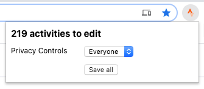

# Strava Bulk Edit

A Chrome extension to edit multiple Strava activities at once.

## Usage

Visit the [My Activities page on Strava.com](https://www.strava.com/athlete/training).
Select the activities you want to edit using the filters at the top of the
overview. Open the plugin, select your desired privacy setting and click the
Save all button. Now wait until all activities have been updated.

## Roadmap

There are a few enhancements I like te make in the future. These are added as
[issues in the repository](https://github.com/MGHollander/strava-bulk-edit).

## Feedback

Please feel free to give feedback, share ideas or report bugs. Email me
at [marchollander@gmail.com](mailto:marchollander@gmail.com) or [add an issue to
the repository](https://github.com/MGHollander/strava-bulk-edit/issues).

## Credits

Inspired by https://github.com/jm-shi/Strava-Bulk-Editing
