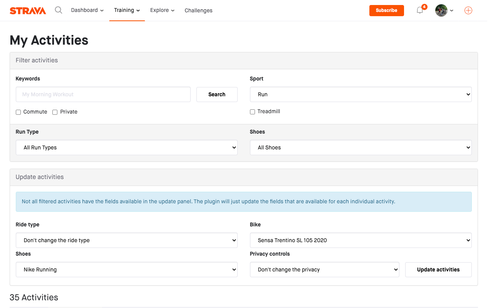

# Strava Bulk Edit

A Chrome extension to edit multiple Strava activities at once.

The extension adds a title to the activity filter panel, and an update panel
below the activity panel. It will go through all filtered activities and
update then one by one.

## Official Releases

- [Google Chrome Extension](https://chrome.google.com/webstore/detail/strava-bulk-edit/mkbkebdegldokaipfgficlleheeejfjg)

## Usage

Visit the [My Activities page on Strava.com](https://www.strava.com/athlete/training).

Use the filters to select the activities you want to edit. Choose the
privacy setting to apply to the selected activities. Click the "Update activities"
button.

A loading screen will now appear while the extension is updating the
activities on the background. The loading screen will close once the activities
have been updated.

## Roadmap

There are a few enhancements I like te make in the future. These are added as
[issues in the repository](https://github.com/MGHollander/strava-bulk-edit).

## Feedback

Please feel free to give feedback, share ideas or report bugs. Email me
at [marc@mghollander.nl](mailto:marc@mghollander.nl) or [add an issue to
the repository](https://github.com/MGHollander/strava-bulk-edit/issues).

## Credits

Inspired by https://github.com/jm-shi/Strava-Bulk-Editing
